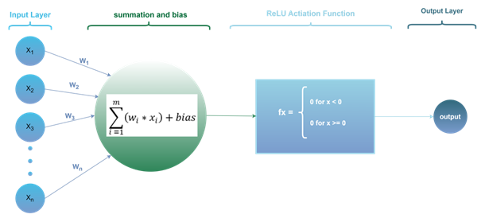

## MLP FROM SCRATCH :heavy_check_mark:
---

## Content

- a basic introduction to neural networks with the `perceptron.py` file. 
    - this file contains a basic perceptron model example.
    - only Numpy and Pandas libraries are used.
    - Leaky ReLU activation function and Gradient Descent Algorithm implemented
    - the dataset is from kaggle: Iris dataset --> https://www.kaggle.com/datasets/uciml/iris
- there is a folder called **perceptron**. It contains `perceptron/perceptron-train.py`, `perceptron/perceptron-test.py`, `perceptron/train.csv` and `perceptron/test.csv` files.
    - these files also use the same dataset but the test and train datasets are in splitted form.
    - On `perceptron/perceptron-train.py`file, there is the model I've made which contains train, test and new-data-prediction functions.I have saved this file as a model so that I can call it in other files. But it is still a perceptron.
    - On `perceptron/perceptron-test.py` file, I call the model from `perceptron/perceptron-train.py`, made a training and found final weights & biases. I have plotted the error change and made new data predictions.

  

- a basic introduction to Multi-Layer Perceptron with the `MLP.py` file.
    

